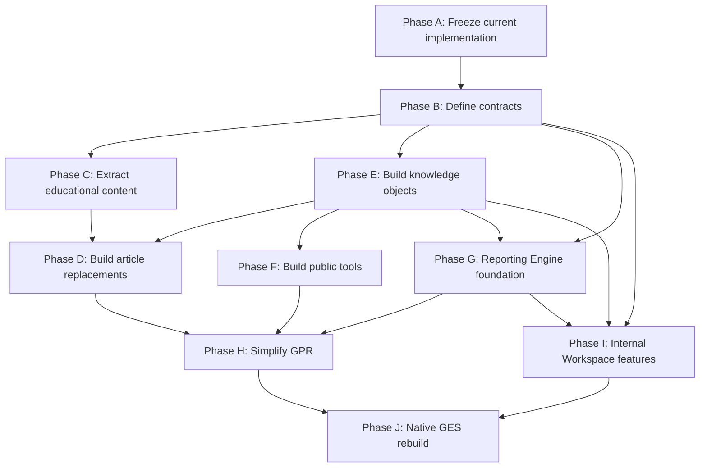

# GPR Implementation Phases

Status: planning roadmap  
Date: 2026-06-28

This roadmap converts the architectural audit and inventories into implementation order. It is designed to reduce rework by creating destination homes before removing responsibility from GPR.

## Phase Sequence

| Phase | Name | Objective | Entry criteria | Exit criteria |
| --- | --- | --- | --- | --- |
| A | Freeze current implementation | Establish baseline behavior and inventory tags | Migration docs approved | Current GPR routes, reports, copy, and data dependencies are documented; no moves made |
| B | Define contracts | Create schemas/interfaces for parcel summary, review flags, reports, citations, knowledge refs, tools | Phase A complete | Contracts exist without behavior changes |
| C | Extract educational content | Convert teaching sections into article drafts and content backlog | Article/knowledge metadata conventions available | GPR teaching sections have destination article ids or backlog ids |
| D | Build article replacements | Publish or draft replacement articles for GPR teaching content | Phase C content inventory complete | GPR can link to article replacements |
| E | Build knowledge objects | Create definitions, statutes, standards, deadlines, forms, sources, formulas, FAQs | Phase B object contracts; Phase C inventory | Articles/tools/GPR can reference knowledge ids |
| F | Build public tools | Extract reusable calculators and explainers | Knowledge citations and formula objects exist | Tools provide standalone routes or article embeds |
| G | Build Reporting Engine foundation | Move report ownership behind report schemas | Phase B report contracts; Knowledge citations | Report types can be generated from report models |
| H | Simplify Guided Parcel Review | Replace course-like flow with parcel workspace | Articles, knowledge links, tools, and reporting engine exist | GPR is shorter, task-oriented, and behaviorally equivalent where needed |
| I | Migrate Internal Workspace features | Move assessor diagnostics behind internal boundary | Workspace shell and reporting/report contracts exist | Internal diagnostics no longer live in public GPR |
| J | Native GES rebuild | Rebuild GPR as native GES app/React or future stack | Contracts stable; responsibilities separated | Native GPR consumes shared services without duplicated logic |

## Dependency Graph



## Critical Dependencies

| Dependency | Why it matters |
| --- | --- |
| Articles before GPR simplification | Prevents deleting teaching content before replacement exists. |
| Knowledge before search integration | Search needs stable object ids, titles, tags, and visibility. |
| Knowledge before public tools | Tools need formulas, definitions, source notes, and citations. |
| Report contracts before PDF rewrite | Avoids rewriting PDFs around unstable data shapes. |
| Reporting Engine before final GPR PDF removal | GPR should not lose report output during migration. |
| Workspace boundary before assessor diagnostics migration | Internal features need a permission-aware home. |
| Public/private policy before QR parcel summaries | QR links can expose data beyond intended audience. |
| Parcel lookup contract before native GPR rebuild | React/SQL rebuild should not copy static sample assumptions. |
| Source provenance model before source modal removal | Public source notes and internal source inspection both need replacements. |

## Estimated Implementation Order

1. Add migration tags and nonfunctional inventory metadata to current GPR sections.
2. Define parcel summary, review flag, report, knowledge-reference, and tool contracts.
3. Create article draft records for high-priority teaching sections.
4. Create glossary/statute/standard/source/deadline/form object backlog.
5. Build high-priority article replacements.
6. Build knowledge object seeds needed by those articles.
7. Build Reporting Engine foundation with current PDF parity.
8. Convert guided summary PDF into conversation summary.
9. Convert correction request PDF into Reporting Engine packet.
10. Extract tax calculator and tax district explorer.
11. Extract equalization metric explainer and CTL explorer.
12. Simplify GPR navigation and page copy.
13. Move assessor report, cost model, source inspection, and diagnostics into Internal Workspace.
14. Rebuild native GPR against stable contracts.

## Risk Analysis

| Risk | Affected areas | Severity | Mitigation |
| --- | --- | --- | --- |
| Teaching content removed before articles exist | GPR, Articles | High | Build article replacements first; preserve links. |
| Legal/procedural language drifts | Articles, Knowledge, GPR | High | Use canonical knowledge objects and human review. |
| Review signals imply official conclusions | GPR, Reports, Internal Workspace | High | Govern thresholds, wording, visibility, and report status. |
| QR summary exposes private notes/contact info | Reporting Engine, GPR | High | Public-safe QR schema and privacy review before implementation. |
| Report rewrite loses data currently printed | Reporting Engine | High | Create report parity checklist before moving rendering. |
| Static sample assumptions leak into native rebuild | GPR, SQL/React | High | Define parcel lookup and source freshness contracts first. |
| Duplicate source/citation strings continue | Render, charts, reports, articles | Medium | Knowledge object ids become required for citations. |
| Public tools duplicate app calculations | GPR, Public Tools | Medium | Shared formula/calculation contracts. |
| Internal diagnostics remain public | GPR, Workspace | High | Add audience mode and permission boundaries. |
| Chart-heavy pages regress performance/accessibility | GPR, Public Tools | Medium | Manual visual/a11y tests and progressive loading. |

## Shared Code And Duplicate Logic To Watch

| Area | Current duplication or coupling |
| --- | --- |
| Tax math | `render.js`, `tax-shorthand-experiment.js`, reports |
| Report generation | `property-report.js`, `recordCorrectionRequest.js`, `assessors-report.js`, `pdf-report-kit.js` |
| Equalization interpretation | `charts.js`, `metric-signals.js`, `assessors-report.js`, GPR copy |
| Source citations | JSON source fields, render strings, chart notes, report footers |
| Footer resources | `site-copy.json` and `route-resources.js` |
| Review signals | Public panel, summary, assessor report, metric signal engine |
| Market/valuation group context | `market-stats.js`, `charts.js`, summary, assessor report |
| Property facts | Record card data, rendered worksheet, report models, correction packet |

## Manual Testing Areas

Manual test coverage will be required for:

- Parcel lookup and selected parcel persistence.
- Property record flags and note persistence.
- Correction packet generation and download.
- Guided summary PDF generation.
- Supplemental assessor report generation behind internal permission.
- Tax equation values against source statements.
- Levy distribution totals and tax district authority source notes.
- Equalization metric rendering by class.
- Public tool embeds in articles.
- QR report links and privacy boundaries.
- Print behavior for reports/articles/tools.
- Mobile layout for simplified GPR workspace.
- Keyboard and screen-reader flows for modals, flags, tabs, and report buttons.

## Technical Debt Summary

- App entrypoint mixes GPR, public articles, experiments, routing, analytics, and internal utilities.
- Educational copy is distributed across HTML, JSON, render modules, chart modules, and report modules.
- Review flags and drafts are localStorage-only.
- Submission behavior is prototype/mock.
- PDF generation lives in browser app modules.
- Seven-step course framing is hardcoded into report output.
- Source/citation strings are not canonical.
- Some chart hooks and render helpers appear legacy or inactive.
- Static sample parcel lookup is not a production data boundary.
- Internal assessor diagnostics are too close to public routes.

## Validation Deliverables

This planning task produces:

- Migration matrix: `migration-plan.md`
- Component inventory: `component-inventory.md`
- Content migration inventory: `content-migration.md`
- Reporting inventory: `reporting-inventory.md`
- Public tool inventory: `public-tool-inventory.md`
- Internal workspace inventory: `internal-workspace-inventory.md`
- Knowledge inventory: `knowledge-inventory.md`
- Dependency graph and roadmap: this file
- Risk and technical debt summary: this file

## Recommended First Engineering Task After Planning

Start with a nonfunctional tagging pass.

Add a small migration metadata layer that maps current GPR panels, major render functions, report modules, and content blocks to the statuses in this plan. The tag map should live in documentation or static metadata first, not in runtime behavior.

Recommended output:

```text
docs/ges/gpr-migration/current-surface-map.md
```

That task should not move code. It should create stable ids for each current surface so later extraction tasks can move one responsibility at a time without losing track of source ownership.

